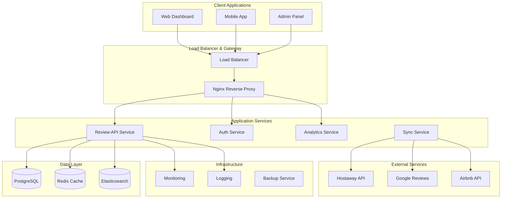
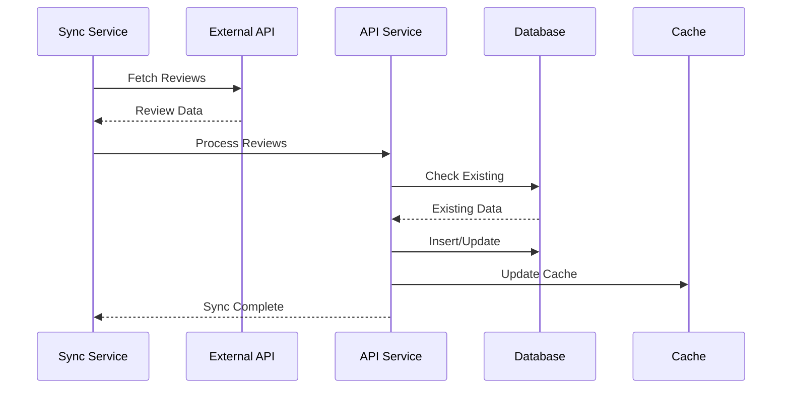
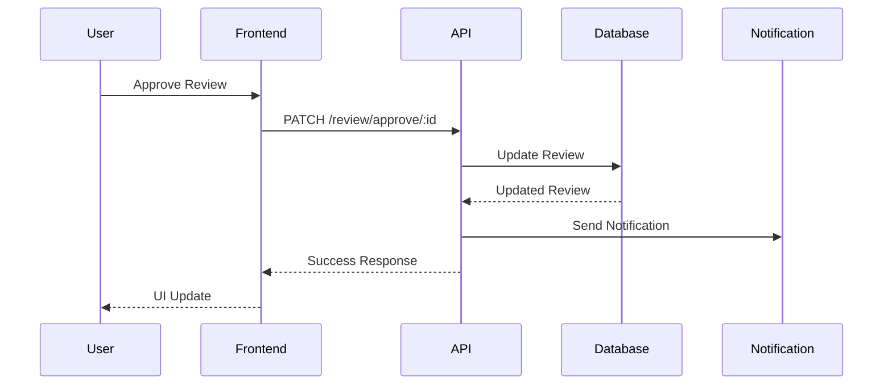
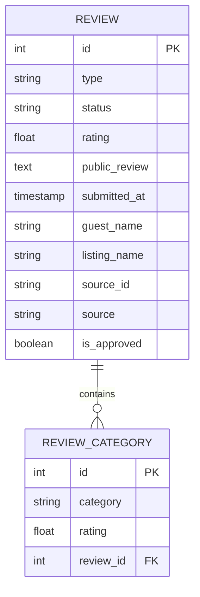
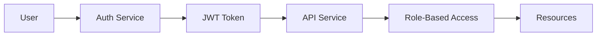

# Flex Living Architecture Documentation

## System Overview

Flex Living is a modern, scalable review management platform built with a microservices architecture. The system is designed to handle high-volume review data from multiple sources while providing real-time analytics and management capabilities.

## High-Level Architecture



## Service Architecture

### 1. Review API Service (NestJS)

**Responsibilities:**

- Review CRUD operations
- Review approval workflow
- Data validation and transformation
- API rate limiting and authentication

**Key Components:**

- `ReviewController`: HTTP request handling
- `ReviewService`: Business logic
- `ReviewRepository`: Data access layer
- `ThirdPartyService`: External API integration

**Database Schema:**

```sql
-- Reviews table
CREATE TABLE review (
    id SERIAL PRIMARY KEY,
    type VARCHAR NOT NULL,
    status VARCHAR DEFAULT 'published',
    rating FLOAT,
    public_review TEXT,
    submitted_at TIMESTAMP DEFAULT NOW(),
    guest_name VARCHAR NOT NULL,
    listing_name VARCHAR NOT NULL,
    source_id VARCHAR NOT NULL,
    source VARCHAR NOT NULL,
    is_approved BOOLEAN DEFAULT FALSE,
    UNIQUE(source, source_id)
);

-- Review categories table
CREATE TABLE review_category (
    id SERIAL PRIMARY KEY,
    category VARCHAR NOT NULL,
    rating FLOAT NOT NULL,
    review_id INTEGER REFERENCES review(id) ON DELETE CASCADE
);
```

### 2. Frontend Service (Next.js)

**Responsibilities:**

- User interface rendering
- State management
- API communication
- Real-time updates

**Key Components:**

- `Dashboard`: Main analytics dashboard
- `ReviewsTable`: Review management interface
- `Charts`: Data visualization components
- `Hooks`: Custom React hooks for data fetching

**State Management:**

```typescript
// Using TanStack Query for server state
const { data: reviews, isLoading } = useQuery({
  queryKey: ["reviews"],
  queryFn: fetchReviews,
  staleTime: 5 * 60 * 1000, // 5 minutes
});
```

### 3. Mock API Service (FastAPI)

**Responsibilities:**

- Development and testing
- API simulation
- Mock data generation
- Authentication simulation

**Key Features:**

- JWT token validation
- Realistic mock data generation
- Rate limiting simulation
- Error response simulation

## Data Flow Architecture

### Review Synchronization Flow



### Review Approval Flow



## Database Design

### Entity Relationship Diagram



### Indexing Strategy

```sql
-- Performance indexes
CREATE INDEX idx_review_approved ON review(is_approved);
CREATE INDEX idx_review_submitted_at ON review(submitted_at);
CREATE INDEX idx_review_listing_name ON review(listing_name);
CREATE INDEX idx_review_source ON review(source);
CREATE INDEX idx_review_category_review_id ON review_category(review_id);
```

## Caching Strategy

### Redis Cache Structure

```typescript
// Cache key patterns
const CACHE_KEYS = {
  REVIEWS: "reviews:all",
  APPROVED_REVIEWS: "reviews:approved",
  API_TOKEN: "third_party_token",
  USER_SESSION: "session:${userId}",
  ANALYTICS: "analytics:${date}",
};

// Cache TTL configuration
const CACHE_TTL = {
  REVIEWS: 300, // 5 minutes
  API_TOKEN: 3600, // 1 hour
  USER_SESSION: 1800, // 30 minutes
  ANALYTICS: 600, // 10 minutes
};
```

### Cache Invalidation Strategy

1. **Write-through**: Update cache immediately on data changes
2. **TTL-based**: Automatic expiration for time-sensitive data
3. **Event-driven**: Invalidate cache on specific events
4. **Pattern-based**: Bulk invalidation using key patterns

## Security Architecture

### Authentication & Authorization



### Security Measures

1. **JWT Authentication**: Stateless token-based authentication
2. **Rate Limiting**: Prevent API abuse
3. **Input Validation**: Comprehensive data validation
4. **SQL Injection Prevention**: Parameterized queries
5. **CORS Configuration**: Controlled cross-origin requests
6. **HTTPS Enforcement**: Encrypted communication

## Monitoring & Observability

### Logging Strategy

```typescript
// Structured logging
const logger = new Logger("ReviewService");

logger.log("Review created", {
  reviewId: review.id,
  listingName: review.listingName,
  rating: review.rating,
  timestamp: new Date().toISOString(),
});
```

### Metrics Collection

- **Application Metrics**: Response times, error rates
- **Business Metrics**: Review counts, approval rates
- **Infrastructure Metrics**: CPU, memory, disk usage
- **Custom Metrics**: Sync success rates, cache hit ratios

### Health Checks

```typescript
@Controller("health")
export class HealthController {
  @Get()
  async checkHealth() {
    return {
      status: "ok",
      timestamp: new Date().toISOString(),
      services: {
        database: await this.checkDatabase(),
        redis: await this.checkRedis(),
        externalApi: await this.checkExternalApi(),
      },
    };
  }
}
```

## Scalability Considerations

### Horizontal Scaling

1. **Stateless Services**: All services are stateless
2. **Load Balancing**: Nginx load balancer
3. **Database Sharding**: Partition by listing ID
4. **Cache Clustering**: Redis cluster for high availability

### Performance Optimization

1. **Database Indexing**: Optimized query performance
2. **Connection Pooling**: Efficient database connections
3. **Caching**: Multi-layer caching strategy
4. **CDN**: Static asset delivery
5. **Compression**: Gzip compression for API responses

## Deployment Architecture

### Container Strategy

```yaml
# Docker Compose services
services:
  api:
    build: ./apps/backend
    ports: ["4000:4000"]
    environment:
      - NODE_ENV=production
    depends_on:
      - postgres
      - redis

  frontend:
    build: ./apps/frontend
    ports: ["3000:3000"]
    depends_on:
      - api

  postgres:
    image: postgres:15-alpine
    environment:
      - POSTGRES_DB=flex_living
    volumes:
      - postgres_data:/var/lib/postgresql/data

  redis:
    image: redis:7-alpine
    volumes:
      - redis_data:/data
```

### Environment Configuration

```typescript
// Environment-specific configurations
const config = {
  development: {
    database: { synchronize: true, logging: true },
    redis: { ttl: 300 },
    cors: { origin: "*" },
  },
  production: {
    database: { synchronize: false, logging: false },
    redis: { ttl: 3600 },
    cors: { origin: ["https://app.flexliving.com"] },
  },
};
```

## API Design Patterns

### RESTful Design

- **Resource-based URLs**: `/api/review`, `/api/review/{id}`
- **HTTP Methods**: GET, POST, PUT, PATCH, DELETE
- **Status Codes**: Standard HTTP status codes
- **Content Negotiation**: JSON responses

### Error Handling

```typescript
@Catch()
export class GlobalExceptionFilter implements ExceptionFilter {
  catch(exception: unknown, host: ArgumentsHost) {
    const ctx = host.switchToHttp();
    const response = ctx.getResponse();
    const request = ctx.getRequest();

    const status =
      exception instanceof HttpException
        ? exception.getStatus()
        : HttpStatus.INTERNAL_SERVER_ERROR;

    response.status(status).json({
      statusCode: status,
      timestamp: new Date().toISOString(),
      path: request.url,
      message: exception.message,
    });
  }
}
```

## Future Architecture Considerations

### Planned Enhancements

1. **Event-Driven Architecture**: Message queues for async processing
2. **Microservices Split**: Separate services for different domains
3. **GraphQL API**: More flexible data fetching
4. **Real-time Updates**: WebSocket implementation
5. **Machine Learning**: AI-powered review analysis

### Technology Roadmap

- **Message Queue**: Apache Kafka or RabbitMQ
- **Search Engine**: Elasticsearch for advanced search
- **Monitoring**: Prometheus + Grafana
- **CI/CD**: GitHub Actions or GitLab CI
- **Container Orchestration**: Kubernetes

---

_This architecture documentation is maintained by the Flex Living development team and updated with each major release._
