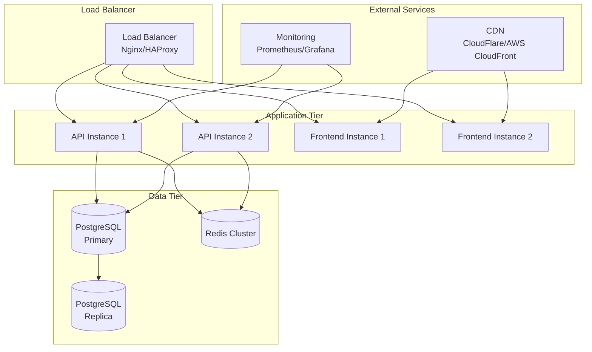

# Flex Living Deployment Guide

## Overview

This guide covers the deployment process for the Flex Living application across different environments, from development to production.

## Deployment Architecture



## Environment Configuration

### Development Environment

```yaml
# docker-compose.dev.yml
version: "3.9"
services:
  backend:
    build:
      context: ./flex-living
      dockerfile: Dockerfile
      target: runner_backend
    ports:
      - "4000:4000"
    environment:
      - NODE_ENV=development
      - DB_HOST=db
      - REDIS_URL=redis://redis:6379
    depends_on:
      - db
      - redis

  frontend:
    build:
      context: ./flex-living
      dockerfile: Dockerfile
      target: runner_frontend
    ports:
      - "3000:3000"
    environment:
      - NEXT_PUBLIC_API_URL=http://localhost:4000/api
    depends_on:
      - backend

  db:
    image: postgres:15-alpine
    environment:
      - POSTGRES_DB=flex_living_dev
      - POSTGRES_USER=postgres
      - POSTGRES_PASSWORD=dev_password
    volumes:
      - postgres_dev_data:/var/lib/postgresql/data
    ports:
      - "5432:5432"

  redis:
    image: redis:7-alpine
    ports:
      - "6379:6379"
    volumes:
      - redis_dev_data:/data
```

### Staging Environment

```yaml
# docker-compose.staging.yml
version: "3.9"
services:
  backend:
    build:
      context: ./flex-living
      dockerfile: Dockerfile
      target: runner_backend
    environment:
      - NODE_ENV=staging
      - DB_HOST=${DB_HOST}
      - DB_PASSWORD=${DB_PASSWORD}
      - REDIS_URL=${REDIS_URL}
    deploy:
      replicas: 2
      resources:
        limits:
          memory: 512M
        reservations:
          memory: 256M

  frontend:
    build:
      context: ./flex-living
      dockerfile: Dockerfile
      target: runner_frontend
    environment:
      - NEXT_PUBLIC_API_URL=${API_URL}
    deploy:
      replicas: 2
      resources:
        limits:
          memory: 256M
        reservations:
          memory: 128M

  nginx:
    image: nginx:alpine
    ports:
      - "80:80"
      - "443:443"
    volumes:
      - ./nginx/nginx.staging.conf:/etc/nginx/nginx.conf
      - ./ssl:/etc/ssl
    depends_on:
      - backend
      - frontend
```

### Production Environment

```yaml
# docker-compose.prod.yml
version: "3.9"
services:
  backend:
    build:
      context: ./flex-living
      dockerfile: Dockerfile
      target: runner_backend
    environment:
      - NODE_ENV=production
      - DB_HOST=${DB_HOST}
      - DB_PASSWORD=${DB_PASSWORD}
      - REDIS_URL=${REDIS_URL}
      - THIRD_PARTY_CLIENT_ID=${THIRD_PARTY_CLIENT_ID}
      - THIRD_PARTY_CLIENT_SECRET=${THIRD_PARTY_CLIENT_SECRET}
    deploy:
      replicas: 3
      resources:
        limits:
          memory: 1G
          cpus: "0.5"
        reservations:
          memory: 512M
          cpus: "0.25"
      restart_policy:
        condition: on-failure
        delay: 5s
        max_attempts: 3

  frontend:
    build:
      context: ./flex-living
      dockerfile: Dockerfile
      target: runner_frontend
    environment:
      - NEXT_PUBLIC_API_URL=${API_URL}
    deploy:
      replicas: 2
      resources:
        limits:
          memory: 512M
          cpus: "0.25"
        reservations:
          memory: 256M
          cpus: "0.1"

  nginx:
    image: nginx:alpine
    ports:
      - "80:80"
      - "443:443"
    volumes:
      - ./nginx/nginx.prod.conf:/etc/nginx/nginx.conf
      - ./ssl:/etc/ssl
    deploy:
      replicas: 2
      resources:
        limits:
          memory: 256M
        reservations:
          memory: 128M
    depends_on:
      - backend
      - frontend
```

## Docker Configuration

### Multi-stage Dockerfile

```dockerfile
# Build stage
FROM node:22.12-alpine AS builder

# Install pnpm
RUN npm install -g pnpm

WORKDIR /app

# Copy package files
COPY pnpm-lock.yaml pnpm-workspace.yaml ./
COPY package.json ./
COPY packages/*/package.json ./packages/*/
COPY apps/*/package.json ./apps/*/

# Install dependencies
RUN pnpm install --frozen-lockfile

# Copy source code
COPY . .

# Build all packages
RUN pnpm build

# Production stage for backend
FROM node:22.12-alpine AS runner_backend

RUN npm install -g pnpm

WORKDIR /app

# Copy built application
COPY --from=builder /app/apps/backend/dist ./dist
COPY --from=builder /app/apps/backend/package.json ./
COPY --from=builder /app/node_modules ./node_modules

# Create non-root user
RUN addgroup -g 1001 -S nodejs
RUN adduser -S nestjs -u 1001
USER nestjs

EXPOSE 4000

CMD ["node", "dist/main.js"]

# Production stage for frontend
FROM node:22.12-alpine AS runner_frontend

RUN npm install -g pnpm

WORKDIR /app

# Copy built application
COPY --from=builder /app/apps/frontend/.next ./.next
COPY --from=builder /app/apps/frontend/public ./public
COPY --from=builder /app/apps/frontend/package.json ./
COPY --from=builder /app/node_modules ./node_modules

# Create non-root user
RUN addgroup -g 1001 -S nodejs
RUN adduser -S nextjs -u 1001
USER nextjs

EXPOSE 3000

CMD ["pnpm", "start"]
```

## Environment Variables

### Development

```bash
# .env.development
NODE_ENV=development
DB_HOST=localhost
DB_PORT=5432
DB_USER=postgres
DB_PASSWORD=dev_password
DB_NAME=flex_living_dev
REDIS_URL=redis://localhost:6379
THIRD_PARTY_API_URL=http://localhost:8000
THIRD_PARTY_CLIENT_ID=dev_client_id
THIRD_PARTY_CLIENT_SECRET=dev_client_secret
```

### Staging

```bash
# .env.staging
NODE_ENV=staging
DB_HOST=staging-db.example.com
DB_PORT=5432
DB_USER=flex_living_staging
DB_PASSWORD=staging_secure_password
DB_NAME=flex_living_staging
REDIS_URL=redis://staging-redis.example.com:6379
THIRD_PARTY_API_URL=https://api.hostaway.com
THIRD_PARTY_CLIENT_ID=staging_client_id
THIRD_PARTY_CLIENT_SECRET=staging_client_secret
API_URL=https://staging-api.flexliving.com
```

### Production

```bash
# .env.production
NODE_ENV=production
DB_HOST=prod-db-cluster.example.com
DB_PORT=5432
DB_USER=flex_living_prod
DB_PASSWORD=production_secure_password
DB_NAME=flex_living_prod
REDIS_URL=redis://prod-redis-cluster.example.com:6379
THIRD_PARTY_API_URL=https://api.hostaway.com
THIRD_PARTY_CLIENT_ID=prod_client_id
THIRD_PARTY_CLIENT_SECRET=prod_client_secret
API_URL=https://api.flexliving.com
```

## Database Migration

### Migration Strategy

```typescript
// src/migrations/001-create-review-table.ts
import { MigrationInterface, QueryRunner } from "typeorm";

export class CreateReviewTable1704067200000 implements MigrationInterface {
  name = "CreateReviewTable1704067200000";

  public async up(queryRunner: QueryRunner): Promise<void> {
    await queryRunner.query(`
      CREATE TABLE "review" (
        "id" SERIAL NOT NULL,
        "type" character varying NOT NULL,
        "status" character varying NOT NULL DEFAULT 'published',
        "rating" double precision,
        "public_review" text,
        "submitted_at" TIMESTAMP NOT NULL DEFAULT now(),
        "guest_name" character varying NOT NULL,
        "listing_name" character varying NOT NULL,
        "source_id" character varying NOT NULL,
        "source" character varying NOT NULL,
        "is_approved" boolean NOT NULL DEFAULT false,
        CONSTRAINT "PK_2d3d8a19ebc4f0387c8b2d4f3a4" PRIMARY KEY ("id")
      )
    `);
  }

  public async down(queryRunner: QueryRunner): Promise<void> {
    await queryRunner.query(`DROP TABLE "review"`);
  }
}
```

### Running Migrations

```bash
# Development
pnpm --filter backend migration:run

# Staging
docker-compose -f docker-compose.staging.yml exec backend pnpm migration:run

# Production
docker-compose -f docker-compose.prod.yml exec backend pnpm migration:run
```

## SSL/TLS Configuration

### Nginx SSL Configuration

```nginx
# nginx/nginx.prod.conf
server {
    listen 443 ssl http2;
    server_name api.flexliving.com;

    ssl_certificate /etc/ssl/certs/flexliving.com.crt;
    ssl_certificate_key /etc/ssl/private/flexliving.com.key;

    ssl_protocols TLSv1.2 TLSv1.3;
    ssl_ciphers ECDHE-RSA-AES256-GCM-SHA512:DHE-RSA-AES256-GCM-SHA512;
    ssl_prefer_server_ciphers off;

    location / {
        proxy_pass http://backend;
        proxy_set_header Host $host;
        proxy_set_header X-Real-IP $remote_addr;
        proxy_set_header X-Forwarded-For $proxy_add_x_forwarded_for;
        proxy_set_header X-Forwarded-Proto $scheme;
    }
}

server {
    listen 80;
    server_name api.flexliving.com;
    return 301 https://$server_name$request_uri;
}
```

## Monitoring and Logging

### Health Checks

```typescript
// src/health/health.controller.ts
@Controller("health")
export class HealthController {
  constructor(
    private health: HealthCheckService,
    private db: TypeOrmHealthIndicator,
    private redis: RedisHealthIndicator
  ) {}

  @Get()
  @HealthCheck()
  check() {
    return this.health.check([
      () => this.db.pingCheck("database"),
      () => this.redis.pingCheck("redis"),
    ]);
  }
}
```

### Logging Configuration

```typescript
// src/main.ts
import { WinstonModule } from "nest-winston";
import * as winston from "winston";

const logger = WinstonModule.createLogger({
  transports: [
    new winston.transports.Console({
      format: winston.format.combine(
        winston.format.timestamp(),
        winston.format.colorize(),
        winston.format.simple()
      ),
    }),
    new winston.transports.File({
      filename: "logs/error.log",
      level: "error",
      format: winston.format.combine(
        winston.format.timestamp(),
        winston.format.json()
      ),
    }),
    new winston.transports.File({
      filename: "logs/combined.log",
      format: winston.format.combine(
        winston.format.timestamp(),
        winston.format.json()
      ),
    }),
  ],
});
```

## CI/CD Pipeline

### GitHub Actions Workflow

```yaml
# .github/workflows/deploy.yml
name: Deploy to Production

on:
  push:
    branches: [main]

jobs:
  test:
    runs-on: ubuntu-latest
    steps:
      - uses: actions/checkout@v3
      - uses: actions/setup-node@v3
        with:
          node-version: "22"
          cache: "pnpm"

      - name: Install pnpm
        run: npm install -g pnpm

      - name: Install dependencies
        run: pnpm install

      - name: Run tests
        run: pnpm test

      - name: Run linting
        run: pnpm lint

      - name: Build applications
        run: pnpm build

  deploy-staging:
    needs: test
    runs-on: ubuntu-latest
    if: github.ref == 'refs/heads/develop'
    steps:
      - uses: actions/checkout@v3
      - name: Deploy to staging
        run: |
          echo "Deploying to staging..."
          # Add staging deployment commands

  deploy-production:
    needs: test
    runs-on: ubuntu-latest
    if: github.ref == 'refs/heads/main'
    environment: production
    steps:
      - uses: actions/checkout@v3
      - name: Deploy to production
        run: |
          echo "Deploying to production..."
          # Add production deployment commands
```

## Deployment Commands

### Local Development

```bash
# Start development environment
docker-compose -f docker-compose.dev.yml up -d

# View logs
docker-compose -f docker-compose.dev.yml logs -f

# Stop services
docker-compose -f docker-compose.dev.yml down
```

### Staging Deployment

```bash
# Deploy to staging
docker-compose -f docker-compose.staging.yml up -d

# Run migrations
docker-compose -f docker-compose.staging.yml exec backend pnpm migration:run

# Check health
curl https://staging-api.flexliving.com/health
```

### Production Deployment

```bash
# Deploy to production
docker-compose -f docker-compose.prod.yml up -d

# Run migrations
docker-compose -f docker-compose.prod.yml exec backend pnpm migration:run

# Check health
curl https://api.flexliving.com/health

# Monitor logs
docker-compose -f docker-compose.prod.yml logs -f
```

## Rollback Strategy

### Database Rollback

```bash
# Rollback to previous migration
docker-compose -f docker-compose.prod.yml exec backend pnpm migration:revert

# Rollback to specific migration
docker-compose -f docker-compose.prod.yml exec backend pnpm migration:revert --to=MigrationName
```

### Application Rollback

```bash
# Rollback to previous image
docker-compose -f docker-compose.prod.yml pull
docker-compose -f docker-compose.prod.yml up -d

# Rollback to specific tag
docker-compose -f docker-compose.prod.yml up -d --image=flex-living:previous-tag
```

## Security Considerations

### Container Security

```dockerfile
# Use non-root user
RUN addgroup -g 1001 -S nodejs
RUN adduser -S app -u 1001
USER app

# Remove unnecessary packages
RUN apk del build-dependencies

# Use specific image tags
FROM node:22.12-alpine@sha256:abc123...
```

### Network Security

```yaml
# docker-compose.prod.yml
networks:
  frontend:
    driver: bridge
  backend:
    driver: bridge
    internal: true

services:
  frontend:
    networks:
      - frontend
      - backend

  backend:
    networks:
      - backend
```

### Secrets Management

```bash
# Use Docker secrets
echo "production_password" | docker secret create db_password -

# Reference in compose file
services:
  backend:
    secrets:
      - db_password
    environment:
      - DB_PASSWORD_FILE=/run/secrets/db_password

secrets:
  db_password:
    external: true
```

## Performance Optimization

### Resource Limits

```yaml
# docker-compose.prod.yml
services:
  backend:
    deploy:
      resources:
        limits:
          memory: 1G
          cpus: "0.5"
        reservations:
          memory: 512M
          cpus: "0.25"
```

### Database Optimization

```sql
-- Create indexes for performance
CREATE INDEX CONCURRENTLY idx_review_approved ON review(is_approved);
CREATE INDEX CONCURRENTLY idx_review_submitted_at ON review(submitted_at);
CREATE INDEX CONCURRENTLY idx_review_listing_name ON review(listing_name);

-- Analyze tables for query optimization
ANALYZE review;
ANALYZE review_category;
```

## Troubleshooting

### Common Issues

1. **Container won't start**

   ```bash
   # Check logs
   docker-compose logs service_name

   # Check resource usage
   docker stats
   ```

2. **Database connection issues**

   ```bash
   # Test database connection
   docker-compose exec backend pnpm migration:run

   # Check database logs
   docker-compose logs db
   ```

3. **Memory issues**

   ```bash
   # Check memory usage
   docker stats

   # Increase memory limits
   # Update docker-compose.yml
   ```

### Debug Commands

```bash
# Enter container
docker-compose exec backend sh

# Check environment variables
docker-compose exec backend env

# Check network connectivity
docker-compose exec backend ping db

# Check disk space
docker-compose exec backend df -h
```

---

_This deployment guide is maintained by the Flex Living DevOps team and updated with each release._
