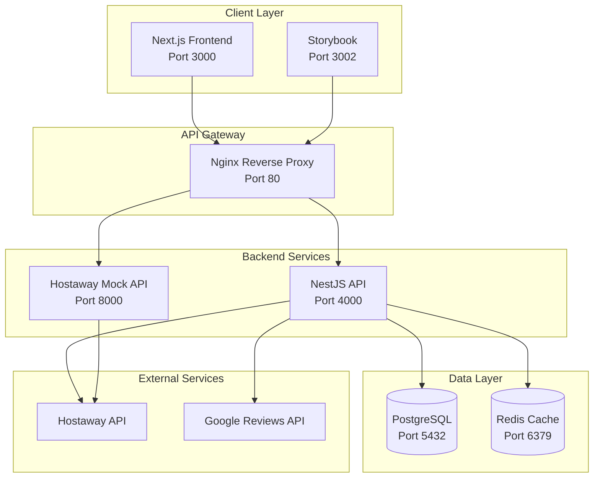
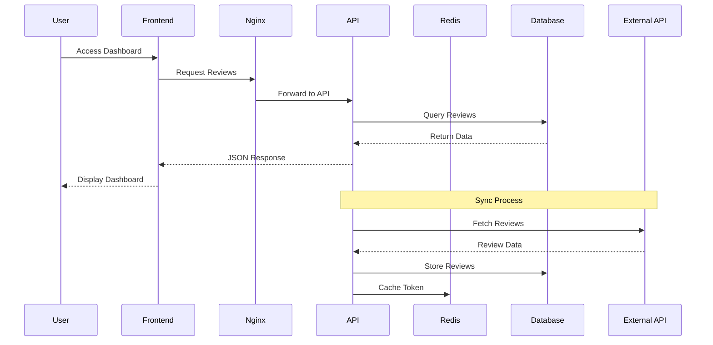

# Flex Living Review Dashboard

A comprehensive review management system for property management companies, built with modern web technologies and designed to aggregate, analyze, and manage guest reviews from multiple sources.

## 📋 Table of Contents

- [Overview](#overview)
- [Architecture](#architecture)
- [Tech Stack](#tech-stack)
- [Project Structure](#project-structure)
- [Prerequisites](#prerequisites)
- [Installation & Setup](#installation--setup)
- [Environment Configuration](#environment-configuration)
- [Running the Application](#running-the-application)
- [API Documentation](#api-documentation)
- [Key Features](#key-features)
- [Design Decisions](#design-decisions)
- [Next Play](#next-play-roadmap)
- [Development Workflow](#development-workflow)
- [Testing](#testing)
- [Deployment](#deployment)
- [Contributing](#contributing)
- [License](#license)

## ✅ Code Quality

- **Testing**: Jest for backend unit/integration tests; Storybook and planned React tests for UI components. See scripts:
  - Backend: `pnpm --filter backend test`, `test:watch`, `test:cov`
  - E2E: `pnpm --filter backend test:e2e`
- **Linting**: ESLint with strict TypeScript rules and Prettier formatting. Pre-commit hooks enforce style automatically.
- **Husky + lint-staged**: Git hooks run ESLint/Prettier on staged files for fast feedback.
- **Commit Convention**: Conventional Commits (e.g., `feat:`, `fix:`, `refactor:`, `docs:`). Example: `feat(review): add approval workflow`.
- **CI-ready**: Turborepo tasks and scripts make it easy to add CI pipelines for tests and linting.

## 🎯 Overview

Flex Living is a sophisticated review management platform designed for property management companies to:

- **Aggregate Reviews**: Collect reviews from multiple sources (Hostaway, Google Reviews, etc.)
- **Analyze Performance**: Provide comprehensive analytics and insights
- **Manage Content**: Approve/disapprove reviews before public display
- **Monitor Trends**: Track rating trends, category breakdowns, and property comparisons
- **Dashboard Analytics**: Real-time metrics and visualizations

## 🏗️ Architecture

### System Architecture Diagram



### Microservices Architecture

The application follows a microservices architecture with clear separation of concerns:

1. **Frontend Service**: Next.js application with React components
2. **Backend API**: NestJS REST API with TypeORM
3. **Mock Service**: FastAPI service for development/testing
4. **Database**: PostgreSQL for persistent storage
5. **Cache**: Redis for session management and API token caching

### Data Flow Architecture



## 🛠️ Tech Stack

### Tech Stack Used (at a glance)

- **Frontend**: Next.js 15, React 19, Tailwind CSS 4, Radix UI, TanStack Query, Recharts
- **Backend**: NestJS 11, TypeORM, PostgreSQL 15, Redis 7, Axios, Swagger
- **Monorepo/Tooling**: Turborepo, pnpm, ESLint, Prettier, Jest, Supertest
- **DevOps**: Docker, Docker Compose, Nginx, FastAPI (mock service)

### Frontend

- **Framework**: Next.js 15.5.6 with App Router
- **UI Library**: Radix UI + Custom Components
- **Styling**: Tailwind CSS 4.0
- **State Management**: TanStack Query (React Query)
- **Charts**: Recharts
- **TypeScript**: Full type safety

### Backend

- **Framework**: NestJS 11.x
- **Database**: PostgreSQL 15 with TypeORM
- **Cache**: Redis 7
- **Validation**: Class Validator + Class Transformer
- **Documentation**: Swagger/OpenAPI
- **HTTP Client**: Axios

### Development Tools

- **Monorepo**: Turborepo + pnpm workspaces
- **Package Manager**: pnpm 10.8.1
- **Linting**: ESLint + Prettier
- **Testing**: Jest + Supertest
- **Containerization**: Docker + Docker Compose

### Mock Services

- **Framework**: FastAPI (Python)
- **Authentication**: JWT middleware
- **Data Generation**: Custom mock data generators

## 📁 Project Structure

```
flex-living/
├── apps/
│   ├── backend/                 # NestJS API
│   │   ├── src/
│   │   │   ├── entities/        # Database entities
│   │   │   ├── review/          # Review module
│   │   │   ├── thrid-parties/   # External API integration
│   │   │   ├── redis/           # Redis configuration
│   │   │   └── common/          # Shared utilities
│   │   └── dist/                # Compiled JavaScript
│   ├── frontend/                # Next.js application
│   │   ├── src/
│   │   │   ├── app/             # App Router pages
│   │   │   ├── components/      # React components
│   │   │   ├── hooks/           # Custom React hooks
│   │   │   └── providers/       # Context providers
│   │   └── public/              # Static assets
│   └── storybook/               # Component documentation
├── packages/
│   ├── types/                   # Shared TypeScript types
│   ├── ui/                      # Reusable UI components
│   └── utils/                   # Shared utilities
├── hostaway-mock-api/           # FastAPI mock service
├── nginx/                       # Reverse proxy configuration
├── docker-compose.yml           # Container orchestration
└── Dockerfile                   # Multi-stage build
```

## ⚙️ Prerequisites

Before running the application, ensure you have:

- **Node.js**: v22.12 or higher
- **pnpm**: v10.8.1 or higher
- **Docker**: v20.10 or higher
- **Docker Compose**: v2.0 or higher
- **Git**: For version control

### System Requirements

- **RAM**: Minimum 4GB, Recommended 8GB
- **Storage**: At least 2GB free space
- **OS**: macOS, Linux, or Windows with WSL2

## 🚀 Installation & Setup

### 1. Clone the Repository

```bash
git clone <repository-url>
cd flex-living
```

### 2. Install Dependencies

```bash
# Install pnpm globally if not already installed
npm install -g pnpm@10.8.1

# Install all dependencies
pnpm install
```

### 3. Environment Setup

Create environment files for different services:

```bash
# Create .env file in project root
touch .env

# Create frontend environment file
touch flex-living/apps/frontend/.env.local
```

### 4. Database Setup

The application uses Docker Compose for database setup. No manual database configuration is required.

## 🔧 Environment Configuration

### Root .env File

```env
# Database Configuration
DB_HOST=localhost
DB_PORT=5432
DB_USER=postgres
DB_PASSWORD=your_password
DB_NAME=flex_living
DB_SYNC=true
DB_LOGGING=true

# Redis Configuration
REDIS_URL=redis://localhost:6379

# Third Party API Configuration
THIRD_PARTY_API_URL=http://localhost:8000
THIRD_PARTY_CLIENT_ID=your_client_id
THIRD_PARTY_CLIENT_SECRET=your_client_secret

# Application Configuration
PORT=4000
NODE_ENV=development
```

### Frontend .env.local

```env
NEXT_PUBLIC_API_URL=http://localhost:4000/api
```

## 🏃‍♂️ Running the Application

### Development Mode (Recommended)

```bash
# Start all services with Docker Compose
docker-compose up -d

# Or run individual services
pnpm dev
```

### Individual Service Commands

```bash
# Backend only
cd flex-living/apps/backend
pnpm dev

# Frontend only
cd flex-living/apps/frontend
pnpm dev

# Mock API only
cd hostaway-mock-api
python -m uvicorn app.main:app --reload --port 8000
```

### Production Mode

```bash
# Build all services
pnpm build

# Start production containers
docker-compose -f docker-compose.prod.yml up -d
```

## 📚 API Documentation

### Base URL

- **Development**: `http://localhost:4000/api`
- **Production**: `https://your-domain.com/api`

### Swagger Documentation

Access interactive API documentation at: `http://localhost:4000/docs`

### Core Endpoints

#### Reviews Management

| Method  | Endpoint                     | Description          | Authentication |
| ------- | ---------------------------- | -------------------- | -------------- |
| `GET`   | `/review`                    | Get all reviews      | None           |
| `GET`   | `/review/approved`           | Get approved reviews | None           |
| `POST`  | `/review`                    | Create new review    | Required       |
| `PATCH` | `/review/approve/:id`        | Approve review       | Required       |
| `PATCH` | `/review/disprove/:id`       | Disapprove review    | Required       |
| `POST`  | `/review/sync-hostaway`      | Sync from Hostaway   | Required       |
| `POST`  | `/review/sync-google-review` | Sync from Google     | Required       |

#### Health Check

| Method | Endpoint | Description  |
| ------ | -------- | ------------ |
| `GET`  | `/`      | Health check |

### Request/Response Examples

#### Get All Reviews

```http
GET /api/review
Content-Type: application/json

Response:
{
  "statusCode": 200,
  "data": [
    {
      "id": 1,
      "type": "guest_review",
      "status": "published",
      "rating": 4.5,
      "publicReview": "Great stay!",
      "submittedAt": "2024-01-15T10:30:00Z",
      "guestName": "John Doe",
      "listingName": "Luxury Apartment",
      "isApproved": true,
      "reviewCategory": [
        {
          "category": "cleanliness",
          "rating": 5
        }
      ]
    }
  ]
}
```

#### Approve Review

```http
PATCH /api/review/approve/1
Content-Type: application/json

Response:
{
  "statusCode": 200,
  "data": {
    "id": 1,
    "isApproved": true,
    // ... other review fields
  }
}
```

## ✨ Key Features

### 1. Review Aggregation

- **Multi-source Integration**: Hostaway, Google Reviews, and more
- **Automatic Sync**: Scheduled synchronization with external APIs
- **Data Normalization**: Consistent data format across sources

### 2. Analytics Dashboard

- **Performance Metrics**: Overall ratings, review counts, trends
- **Category Breakdown**: Detailed analysis by review categories
- **Property Comparison**: Side-by-side property performance
- **Rating Distribution**: Visual representation of rating patterns

### 3. Review Management

- **Approval Workflow**: Manual review approval process
- **Bulk Operations**: Mass approve/disapprove functionality
- **Search & Filter**: Advanced filtering capabilities
- **Export Options**: Data export in multiple formats

### 4. Real-time Updates

- **Live Dashboard**: Real-time metric updates
- **WebSocket Support**: Instant notifications
- **Caching Strategy**: Redis-based performance optimization

## 🎨 Design Decisions

### 1. Monorepo Architecture

**Decision**: Use Turborepo with pnpm workspaces
**Rationale**:

- Shared code between frontend and backend
- Consistent dependency management
- Simplified CI/CD pipeline
- Better developer experience

### 2. TypeScript Everywhere

**Decision**: Full TypeScript implementation
**Rationale**:

- Type safety across the entire stack
- Better IDE support and autocomplete
- Reduced runtime errors
- Improved maintainability

### 3. Database Design

**Decision**: PostgreSQL with TypeORM
**Rationale**:

- ACID compliance for data integrity
- Rich querying capabilities
- Excellent TypeScript integration
- Mature ecosystem

### 4. Caching Strategy

**Decision**: Redis for API tokens and session data
**Rationale**:

- Fast in-memory storage
- Automatic expiration support
- High availability
- Easy horizontal scaling

### 5. API Design

**Decision**: RESTful API with Swagger documentation
**Rationale**:

- Industry standard
- Easy to understand and consume
- Excellent tooling support
- Clear documentation

### 6. Frontend Architecture

**Decision**: Next.js with App Router
**Rationale**:

- Server-side rendering capabilities
- Excellent performance
- Built-in optimization
- Modern React patterns

## 🗺️ Next Play (Roadmap)

- **Authentication & Authorization (ABAC)**:
  - Implement authentication flow (login/logout, refresh tokens)
  - Add Attribute-Based Access Control for fine-grained permissions
  - Define attributes for users, resources, and actions; enforce via guards
- **Security Enhancements**:
  - Add rate limiting, helmet headers, input sanitization
  - Secrets management and secure config handling
  - Audit logging and anomaly detection hooks
- **UI/UX Improvements**:
  - Refine information hierarchy and visual consistency
  - Improve accessibility (WCAG), keyboard navigation, and theming
  - Add empty/error/loading states across pages
- **Codebase Cleanup**:
  - Extract shared primitives and utilities to `packages/`
  - Establish strict ESLint/Prettier rules and CI checks
  - Remove dead code and align naming conventions
- **Testing Strategy Expansion**:
  - Add unit tests for services and hooks
  - Add integration/e2e tests for critical user journeys
  - Snapshot tests for UI components and visual regression via Storybook
- **Rendering Strategy (SSR/SSG)**:
  - Increase server-side rendering for data-heavy views
  - Use SSG/ISR for public/marketing and stable analytics pages
  - Cache headers and React streaming where applicable
- **Metadata & SEO**:
  - Add comprehensive Open Graph/Twitter meta tags
  - Structured data (JSON-LD) for review content
  - Sitemap, robots, canonical URLs, and i18n routing

## 🔄 Development Workflow

### 1. Feature Development

```bash
# Create feature branch
git checkout -b feature/new-feature

# Make changes
# Run tests
pnpm test

# Commit changes
git commit -m "feat: add new feature"

# Push and create PR
git push origin feature/new-feature
```

### 2. Code Quality

- **ESLint**: Automatic code linting
- **Prettier**: Code formatting
- **Husky**: Git hooks for quality checks
- **TypeScript**: Compile-time type checking

### 3. Testing Strategy

- **Unit Tests**: Jest for individual functions
- **Integration Tests**: API endpoint testing
- **E2E Tests**: Full application testing
- **Component Tests**: Storybook for UI components

## 🧪 Testing

### Running Tests

```bash
# Run all tests
pnpm test

# Run backend tests
cd flex-living/apps/backend
pnpm test

# Run frontend tests
cd flex-living/apps/frontend
pnpm test

# Run E2E tests
pnpm test:e2e
```

### Test Coverage

```bash
# Generate coverage report
pnpm test:cov

# View coverage in browser
open coverage/lcov-report/index.html
```

## 🚀 Deployment

### Docker Deployment

```bash
# Build production images
docker-compose -f docker-compose.prod.yml build

# Deploy to production
docker-compose -f docker-compose.prod.yml up -d
```

### Environment Variables for Production

```env
NODE_ENV=production
DB_HOST=your-production-db-host
DB_PASSWORD=your-secure-password
REDIS_URL=your-redis-url
THIRD_PARTY_CLIENT_ID=your-production-client-id
THIRD_PARTY_CLIENT_SECRET=your-production-secret
```

### Health Checks

```bash
# Check application health
curl http://localhost:4000/

# Check database connection
curl http://localhost:4000/api/health/db

# Check Redis connection
curl http://localhost:4000/api/health/redis
```

## 🤝 Contributing

### Development Setup

1. Fork the repository
2. Create a feature branch
3. Make your changes
4. Add tests for new functionality
5. Ensure all tests pass
6. Submit a pull request

### Code Standards

- Follow TypeScript best practices
- Write comprehensive tests
- Update documentation
- Use conventional commit messages
- Ensure code passes linting

### Pull Request Process

1. **Description**: Clear description of changes
2. **Testing**: Evidence of testing
3. **Documentation**: Updated docs if needed
4. **Review**: Code review by maintainers
5. **Merge**: Squash and merge to main

## 📄 License

This project is licensed under the UNLICENSED License - see the [LICENSE](LICENSE) file for details.

## 📞 Support

For support and questions:

- **Email**: abenezergoo@gmail.com
- **Issues**: [GitHub Issues](https://github.com/your-repo/issues)
- **Documentation**: [Project Wiki](https://github.com/your-repo/wiki)

## 🔗 Related Links

- [NestJS Documentation](https://docs.nestjs.com/)
- [Next.js Documentation](https://nextjs.org/docs)
- [TypeORM Documentation](https://typeorm.io/)
- [Tailwind CSS Documentation](https://tailwindcss.com/docs)
- [Docker Documentation](https://docs.docker.com/)

---

**Built with ❤️ by the Flex Living Team**
